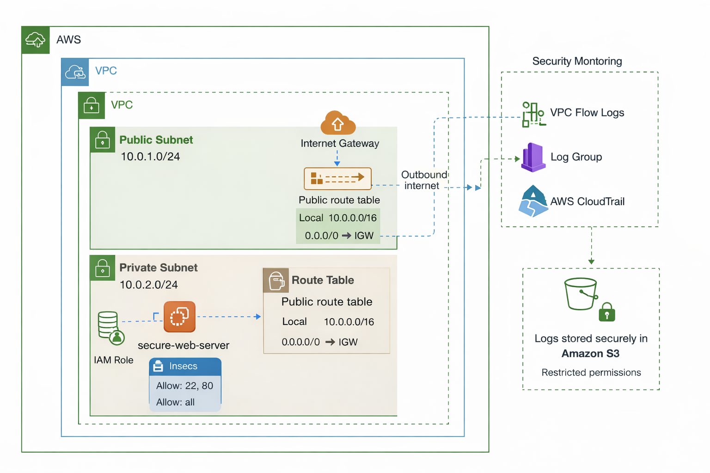
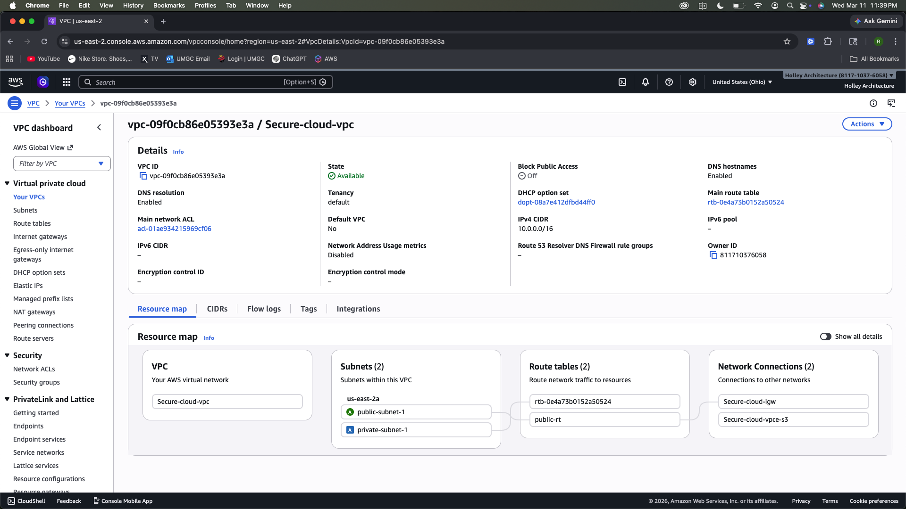
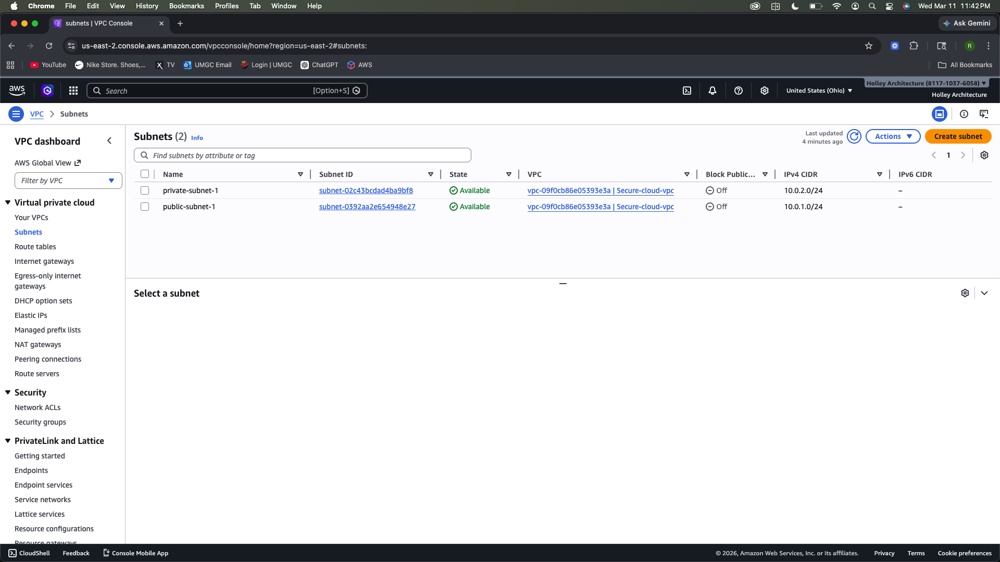
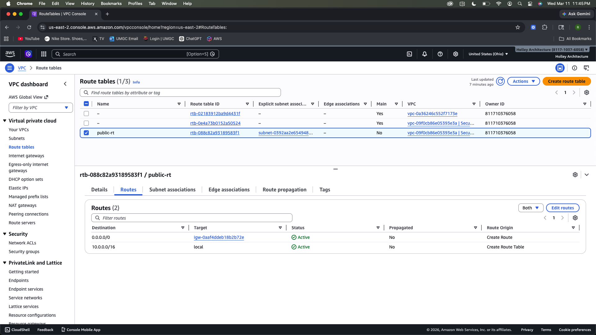
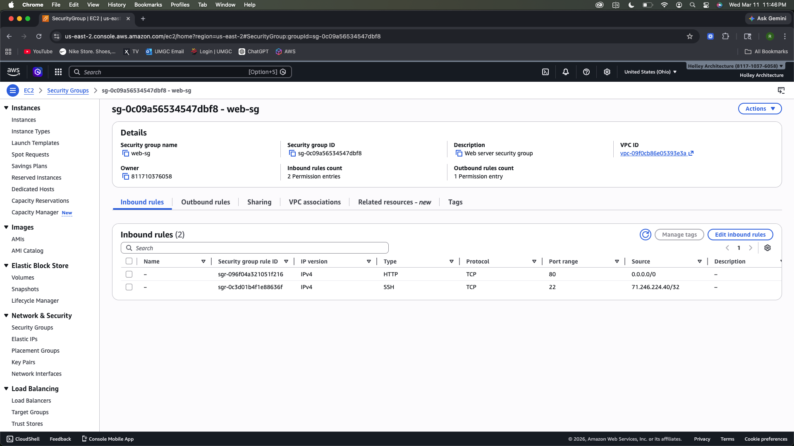
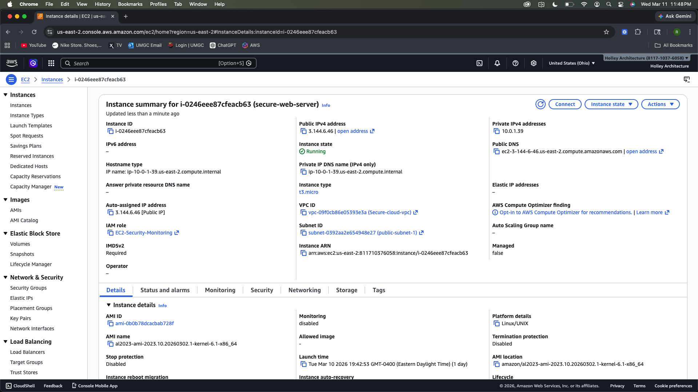
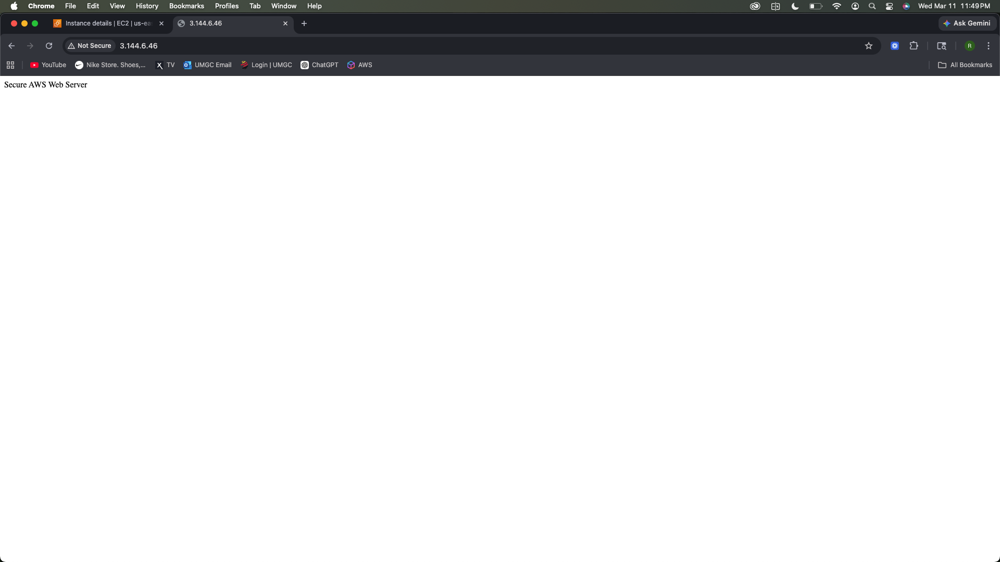
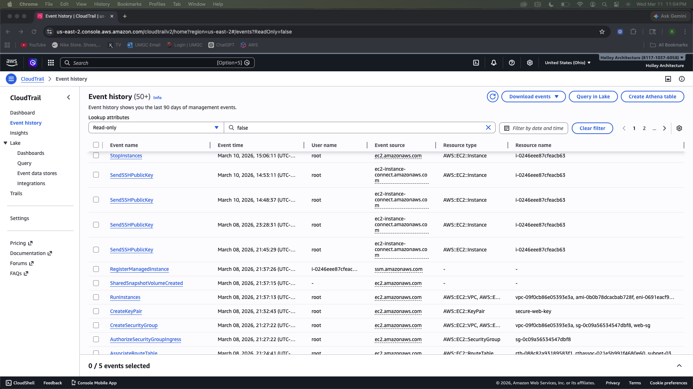
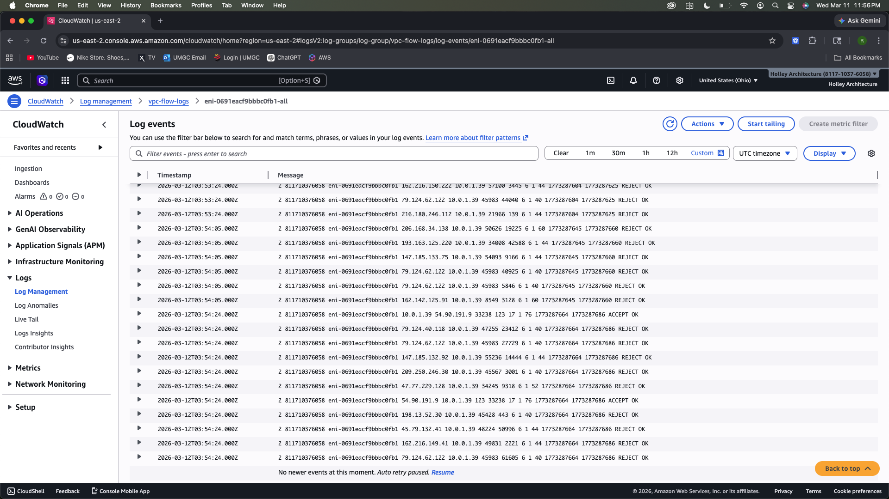
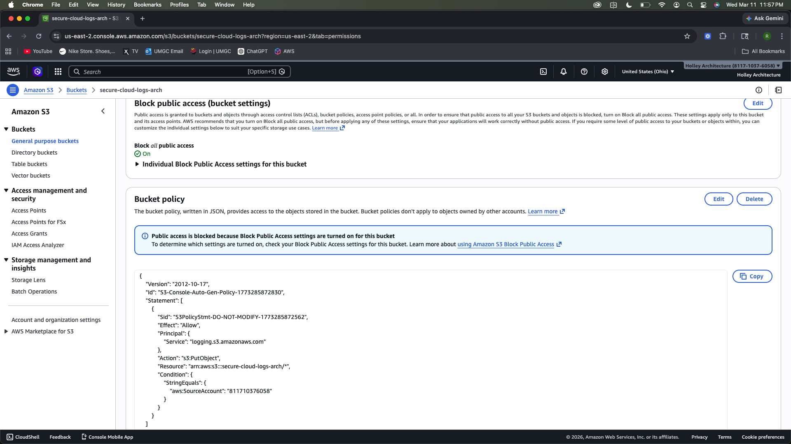

# AWS Secure Cloud Environment

This project demonstrates how to build and secure an AWS cloud environment using network segmentation, identity access management, logging, and monitoring.

## Architecture

The environment includes:

- VPC with public and private subnets
- Internet gateway and route tables
- EC2 web server
- Security groups
- IAM role for instance permissions
- CloudTrail logging
- VPC Flow Logs
- S3 secure storage

## Architecture Diagram

## Architecture Overview

This project demonstrates a secure AWS cloud environment built using:

- A custom VPC with segmented public and private subnets
- An Internet Gateway for controlled internet access
- Route tables for traffic routing
- A secure EC2 web server hosted in the public subnet
- Security groups restricting inbound SSH and HTTP traffic
- IAM roles providing least-privilege permissions
- CloudTrail logging for API activity monitoring
- VPC Flow Logs for network traffic monitoring
- Secure S3 storage for log retention

## Security Threat Model

This project was designed to address common cloud security risks in AWS environments.

### Threats Considered

**1. Unauthorized administrative access**
- Risk: An attacker attempts to gain SSH access to the EC2 instance.
- Mitigation: SSH access is restricted by security group rules and limited to trusted sources.

**2. Excessive network exposure**
- Risk: Resources are exposed unnecessarily to the internet.
- Mitigation: The environment uses public and private subnet segmentation, with controlled routing through an Internet Gateway.

**3. Misuse of AWS API actions**
- Risk: Unauthorized or unexpected changes are made to cloud resources.
- Mitigation: AWS CloudTrail logs API activity for monitoring and investigation.

**4. Suspicious network traffic**
- Risk: Malicious or unexpected inbound/outbound traffic occurs inside the VPC.
- Mitigation: VPC Flow Logs capture network metadata for traffic analysis and visibility.

**5. Overprivileged access to cloud resources**
- Risk: Users or services have more permissions than necessary.
- Mitigation: IAM roles and least-privilege principles are used to limit access.

**6. Insecure storage access**
- Risk: Sensitive logs or stored data are exposed publicly.
- Mitigation: The S3 bucket is configured with public access blocked and restricted permissions.

### Security Objectives

The main security goals of this architecture are:

- Limit unnecessary exposure to the public internet
- Enforce least-privilege access controls
- Improve visibility into AWS account and network activity
- Support investigation of administrative and network events
- Protect log data and cloud resources from unauthorized access

## Security Controls Implemented

- **Network segmentation:** Public and private subnets separate internet-facing and internal resources
- **Security groups:** Inbound traffic is restricted to only required ports
- **IAM role-based access:** AWS permissions are assigned through IAM roles instead of embedded credentials
- **CloudTrail logging:** API activity is recorded for auditing and investigation
- **VPC Flow Logs:** Network traffic metadata is collected for monitoring
- **S3 protection:** Public access is blocked to protect stored logs and project data

## VPC Architecture

## Subnet Configuration

## Route Table

## Security Group Rules

## EC2 Instance

## Web Server Test

## CloudTrail Monitoring

## VPC Flow Logs

## S3 Secure Storage

## Security Controls Implemented

- Network segmentation using public and private subnets
- Least-privilege IAM role for EC2 access
- Security group restrictions for SSH and HTTP
- CloudTrail API activity logging
- VPC Flow Logs network monitoring
- Secure S3 storage configuration

## Author

Richard Holley
